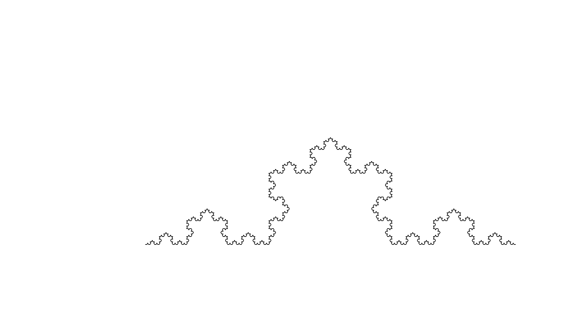
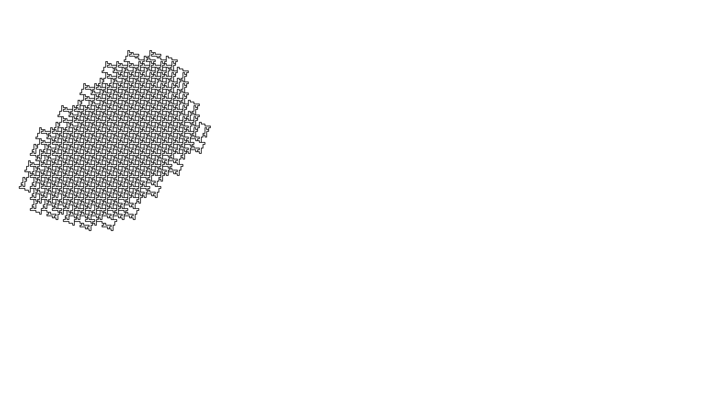
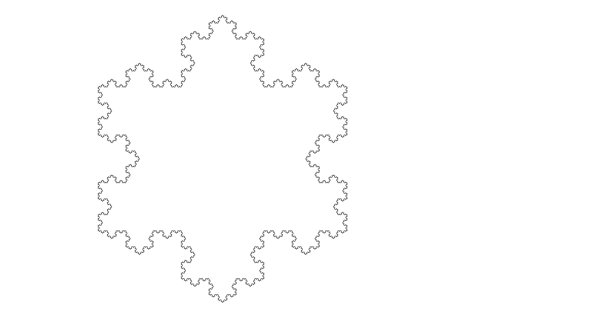
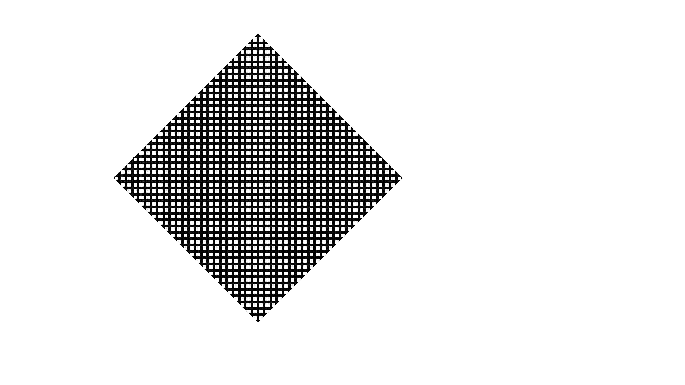

# Draw Fractal Shape

## Create L-System Output

With [LSystem.py](https://github.com/belongtothenight/CF_Code/blob/main/src/LSystem/python/LSystem.py), we can specify different combinations of input to create different output shapes.

## Draw L-System with Python Turtle

Using [drawLSystem.py](https://github.com/belongtothenight/CF_Code/blob/main/src/LSystem/python/drawLSystem.py) with a function from [LSystem.py](https://github.com/belongtothenight/CF_Code/blob/main/src/LSystem/python/LSystem.py), we can use generated word of L-System to control the movements of the pen and generate pictures.

## Draw L-System with Blender Grease Pencil

1. Use [exportLSystemToCo.py](https://github.com/belongtothenight/CF_Code/blob/main/src/LSystem/python/exportLSystemToCo.py)
2. Open blender project with 2D animation.
3. Switch to the scripting tab and load [animate.py](https://github.com/belongtothenight/CF_Code/blob/main/src/LSystem/python/animate.py). Source: <https://www.youtube.com/watch?v=csQNmnc5xQg&list=LL&index=2>
4. Execute the script with proper settings and wait for the stroke to finish.
5. Animate the stroke with <https://www.youtube.com/watch?v=l96CjcqSj_g&list=LL&index=1>.
6. Render it either as an image or video, make sure to use Eevee and lower the rendering sample count to lower than 16.

It is possible to use batch script [multiRender.bat](https://github.com/belongtothenight/CF_Code/blob/main/src/LSystem/python/multiRender.bat) to render multiple files in sequence, but it can't utilize GPU with it.

[Q.blend](https://github.com/belongtothenight/CF_Code/blob/main/src/LSystem/python/Q.blend) is the source blend file, which is saved as [Q0.blend](https://github.com/belongtothenight/CF_Code/blob/main/src/LSystem/python/Q0.blend), [Q1.blend](https://github.com/belongtothenight/CF_Code/blob/main/src/LSystem/python/Q1.blend), [Q2.blend](https://github.com/belongtothenight/CF_Code/blob/main/src/LSystem/python/Q2.blend), and [Q3.blend](https://github.com/belongtothenight/CF_Code/blob/main/src/LSystem/python/Q3.blend) for their corresponding rendering settings.

However, despite using GPU computing, blender simply cannot handle the large coordinate count in Q1 and Q2. It takes longer and longer as frames count up.

## Result

Of the L-Systems setups in [LSystem.py](https://github.com/belongtothenight/CF_Code/blob/main/src/LSystem/python/LSystem.py), all four of them are animated and uploaded in the following links: (Q1 & Q3 are too time consuming to animate with blender)

1. [L-System Q0 l5 blender 0001 1025](https://youtu.be/Ytb8o1PvdPo)
2. [L-System Q1 l5 blender 0001 131073 partial](https://www.youtube.com/watch?v=xImK8u8pUbk)
3. [L-System Q2 l5 blender 0001 3073](https://www.youtube.com/watch?v=S1v0_jaVa5U)
4. [L-System Q3 l5 blender 0001 59050 partial](https://www.youtube.com/watch?v=POXbev50OmA)

| Question | Turtle-Pic                         | Blender-Pic                                 |
| -------- | ---------------------------------- | ------------------------------------------- |
| Q0       |  |    |
| Q1       |  |  |
| Q2       |  |    |
| Q3       |  |   |
