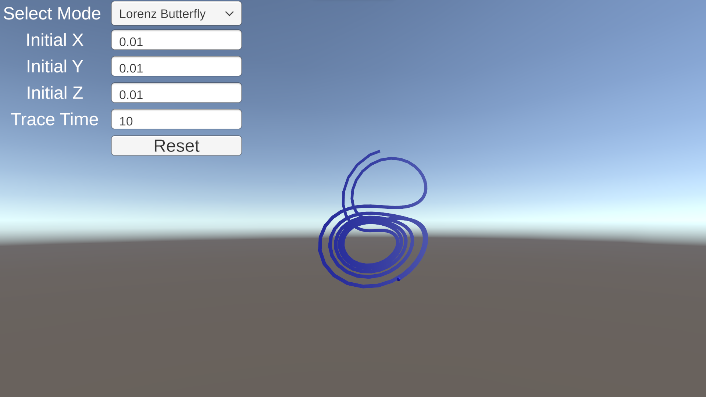
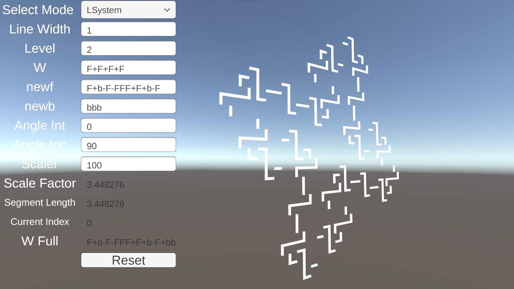
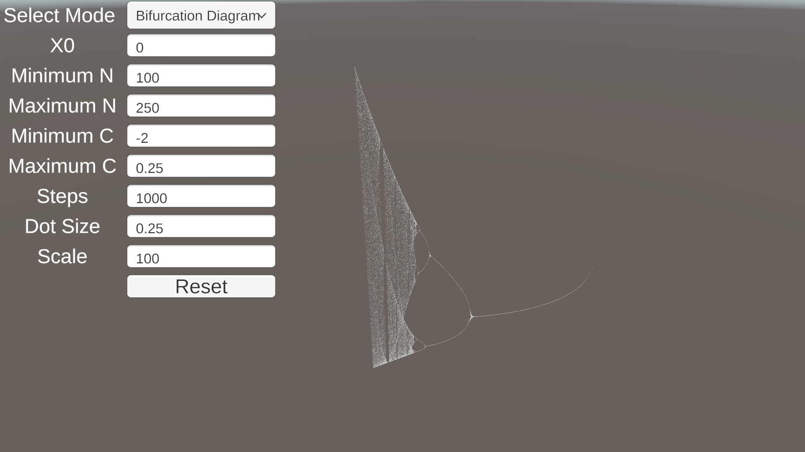

# Final Project

Application to draw multiple graphs of this class.

There are three modes of this application, "Lorentz Butterfly", "LSystem", and "Bifurcation Diagram". The first and second modes are finished, but the third is still under work.

If you're interested in codes used in this application, they are available in the folder "Assets" above as ".cs" files.

## Version Details

If Windows is warning about these being unrecognized apps, click "More info", and "Run anyway" to start the installation process.

| Release Version | Download Link                                                                                                                                               | Detail                   | Release Date |
| :-------------: | ----------------------------------------------------------------------------------------------------------------------------------------------------------- | ------------------------ | :----------: |
| v0.1.0          |  | + Lorentz Butterfly      | 20230620     |
| v0.2.0          |  | + LSystem                | 20230621     |
| v0.2.1          |  | * Fix gameObject removal | 20230621     |
| v0.3.0          |  | + Bifurcation Diagram    | 20230622     |

## Control Tutorial

On the top-left corner of the screen, the "select mode" section can be accessed to change the current execution mode.
Other input fields are provided for any changes to the parameters.
"Reset" buttons are available for both modes to apply new parameters and execute them.
The user can move around in the virtual space to see these shapes from different angles.

| Key          | Function                                               |
| :----------: | ------------------------------------------------------ |
| ESC          | Quit application.                                      |
| R            | Hide/Show cursor, Lock/Unlock camera following cursor. |
| W            | Move front.                                            |
| S            | Move back.                                             |
| A            | Move left.                                             |
| D            | Move right.                                            |
| SPACE        | Move up.                                               |
| LSHIFT       | Move down.                                             |
| SCROLL WHEEL | Increase/Decrease moving speed.                        |

## Lorentz Butterfly

In this mode, it's going to dynamically display how the Lorentz system progresses as time increases.
The user can increase the value of "Trace Time" to make the lines stay longer on the screen.

Reference: <https://joinerda.github.io/Lorenz-Butterfly/>

## LSystem

In this mode, it's going to display the shape created by LSystem after the user clicked "Reset".

## Bifurcation Diagram

In this mode, it's going to display the shape of bifurcation diagrams after the user clicked "Reset".